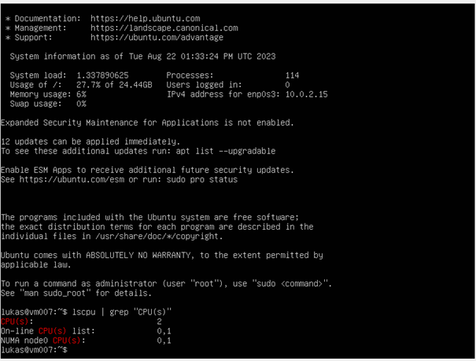
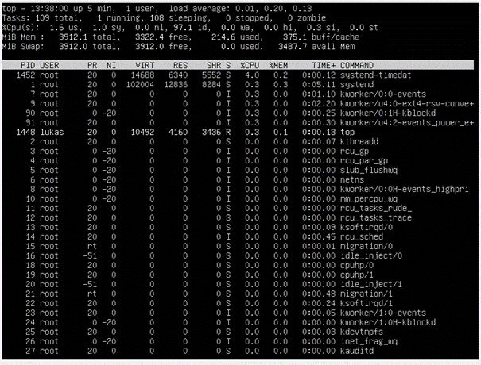
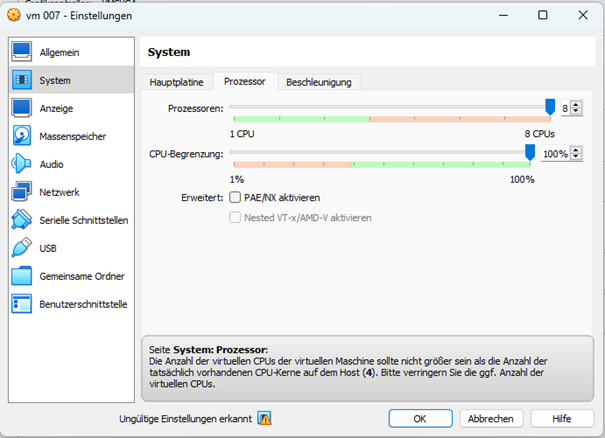
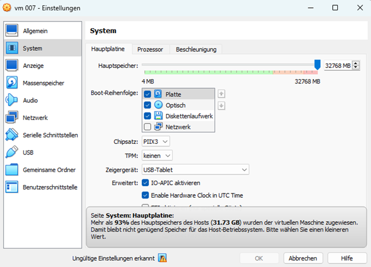

# KN01
## Virtualisierung

### VM hat weniger CPU als Gast

Der VM wurden weniger CPU Ressourcen zur Verfügung gestellt, als dem Host.

### VM hat weniger RAM als Gast

Nun wurden der VM weniger Ram als dem Host zur Verfügung gegeben.

### Fehlermeldung VM

In den oberen beiden Bildern werden Fehlermeldungen von CPU und RAM angezeigt.
Diese resultieren daraus, dass man der VM mehr Ressourcen zur Verfügung stellt, als das Gastsystem eigentlich hat.

Auffallend ist, dass bei der CPU-Fehlermeldung der OK-Balken nicht ausgegraut ist, bei der RAM-Fehlermeldung hingegen schon.

### Grund der Fehlermeldung

Wenn dem Gast-System mehr Ressourcen genommen werden, als es eigentlich hat, kann es selbst nicht mehr funktionieren.
Der Hypervisor gleicht mit dem Host ab, ob genügend Ressourcen zu Verfügung stehen. Ist dies nicht der Fall, resultieren daraus Fehlermeldungen.

Theoretisch gesehen, kann man auch CPU-Kerne emulieren und den RAM auslageren (auf die SSD) und so mehr CPU/RAM zuweisen, als der Host eigentlich hat. In diesem Fall war das aber nicht möglich, da VMware dies nicht ermöglicht.

