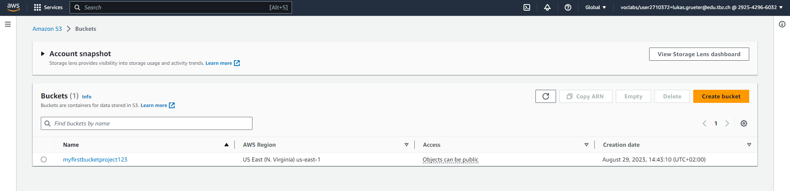
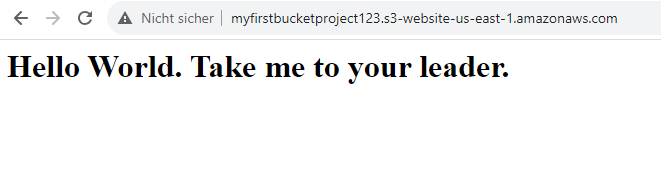
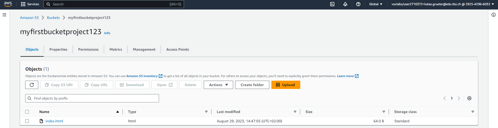
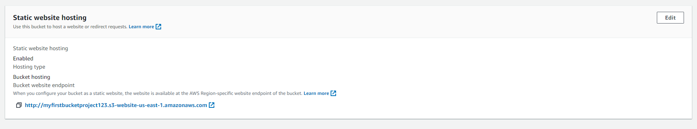

# KN02

## IaaS - Virtuelle Server

### AWS Kurs: Lab 4.1 - EC2

In den oben angefügten Screenshots sehen wir eine VM, welche mittels AWS aufgesetzt wurde.
Über die öffentliche IP haben wir die Website abgefragt und sehen den Schriftzug "Hello World!".
Weiter haben wir eine Inbound Rule erstellt, um unerwünschten Datenverkehr mit der VM zu verhindern.

### AWS Kurs: Lab 4.2 - S3

In diesen Screenshots sehen wir einen S3 Bucket, welchen wir erstellt haben, um eine HTML Datei darin zu speichern.
Um diesen HTML darstellen zu können haben wir zusätzlich eine statische Website erstellt und können so einfach darauf zugreifen.

