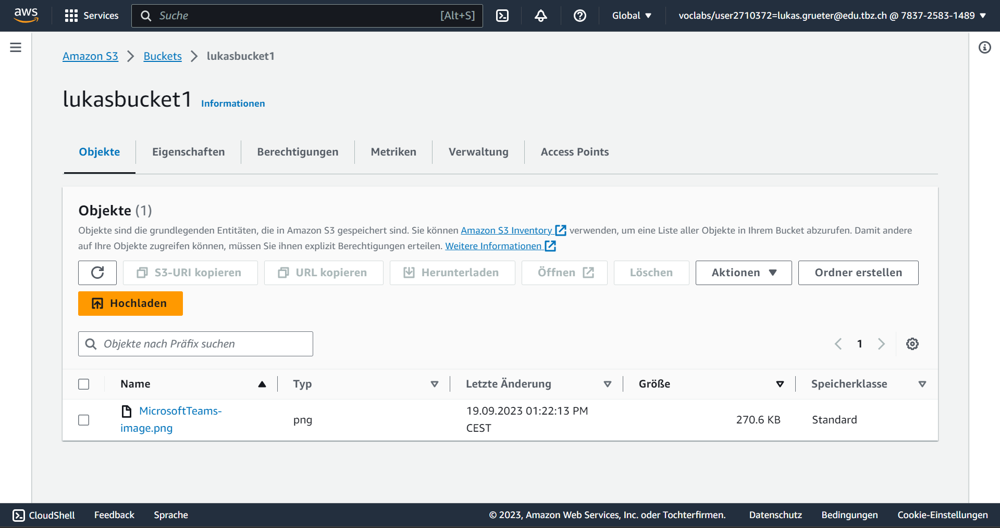
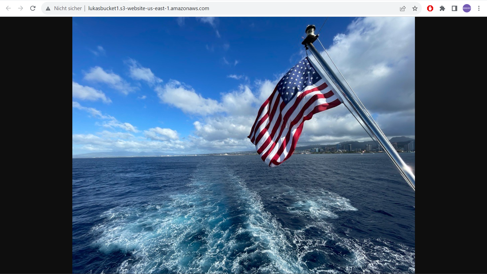
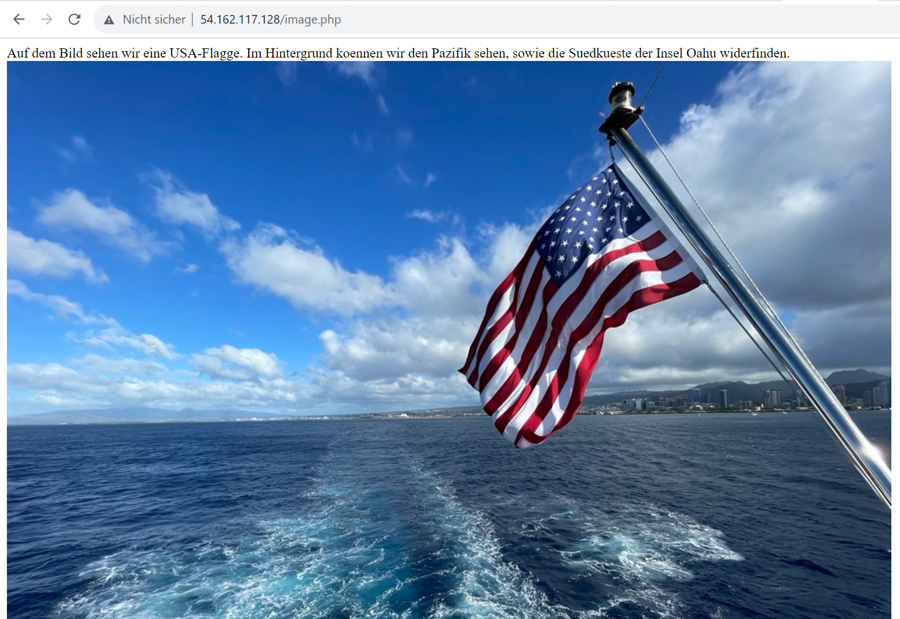
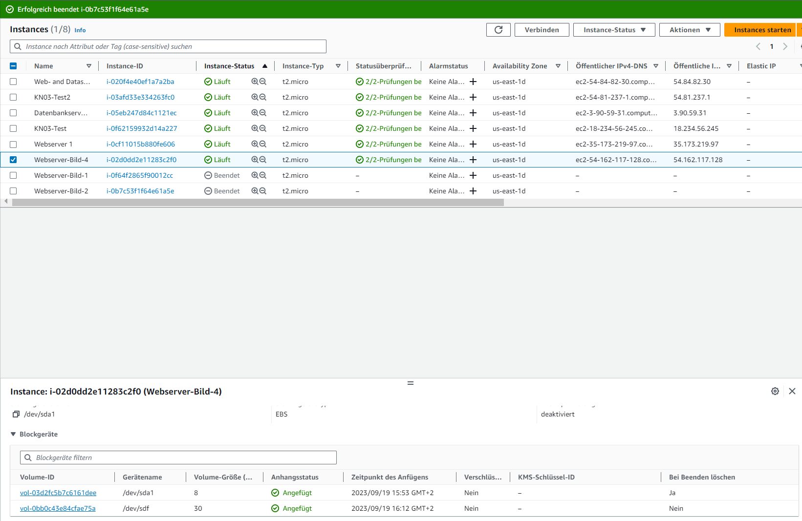
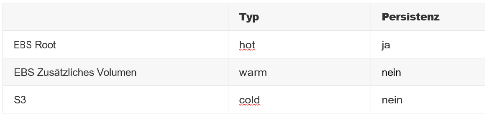

# KN04

## Cloud-init / Storage

### Bild erstellen und auf S3 hosten

Man kann im Bucket das hochgeladene Bild mit Dateinamen sehen. Ebenfalls ist es über eine Website abrufbar und kann dort angezeigt werden.

### Web-Server mit PHP-Seite hinzufügen

Die Cloud-init für angepasst und auf den Bucket referenziert. Nun können wir dem Bild über den Webserver Beschreibungen, Quellenangaben und zusätzliche Informationen anfügen.

### Elastic Block Storage (EBS) hinzufügen

Zusätzliche 30 GB wurden dem Webserver angefügt und stehen nun bereit für weitere Bilder oder andere Dateien.

### Speichereigenschaften erkennen

EBS: Es ist hot, da ansonsten der Server nicht läuft. Weiter kann er nicht persistent sein, da beim Beenden das Volume gelöscht wird.

EBS zusätzliches Volumen: Es ist hot, da es die selbe Kapazität der Möglichkeiten des Roots hat. Persistent, da es bei Beenden nicht gelöscht wird.

S3: Es ist warm, da es auf Abruf verlangt wird und auf einer Website verfügbar ist. Daher ist es auch persistent.