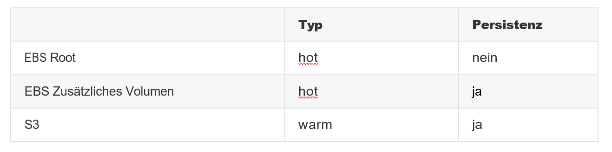

# KN04

## Cloud-init / Storage

### Bild erstellen und auf S3 hosten

Man kann im Bucket das hochgeladene Bild mit Dateinamen sehen. Ebenfalls ist es über eine Website abrufbar und kann dort angezeigt werden.

### Web-Server mit PHP-Seite hinzufügen

Die Cloud-init für angepasst und auf den Bucket referenziert. Nun können wir dem Bild über den Webserver Beschreibungen, Quellenangaben und zusätzliche Informationen anfügen.

### Elastic Block Storage (EBS) hinzufügen

Zusätzliche 30 GB wurden dem Webserver angefügt und stehen nun bereit für weitere Bilder oder andere Dateien.

### Speichereigenschaften erkennen

EBS: Es ist hot, da ansonsten der Server nicht läuft. Weiter muss er persistent sein, da verschiedene Services darauf laufen.

EBS zusätzliches Volumen: Es ist warm, da es nicht andauernd vom Server verwendet werden muss und nur als Zusatz dient. Deswegen sind sie auch nicht persistent.

S3: Es ist cold, da es nur auf Abruf und wenn nötig verlangt wird, zudem werden dort weniger Daten übertragen. Daher ist es auch nicht persistent.