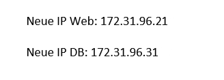

# KN05

## Netzwerk / Sicherheit

### Diagramm erstellen

TEXT

### Subnetz und private IP wählen

TEXT

### Objekte und Instanzen erstellen

[Cloud init DB](cloud-init-db.yaml)
[Cloud init WEB](cloud-init-web.yaml)

TEXT