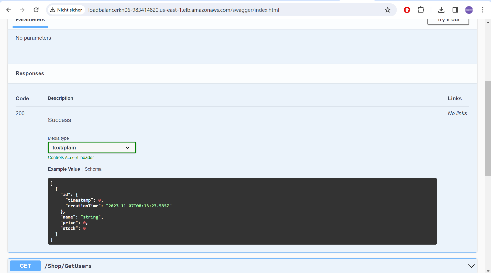

# KN06

## Installation App

### MongoDB als Datenbank einrichten

Ein Reverse-Proxy fungiert als eine Art Vermittler, der zwischen einem oder mehreren Webservern und den Anfragen von Clients steht. Er übernimmt die eingehenden Anfragen von den Clients und leitet sie an die entsprechenden Server weiter.

### Vertikale Skalierung

In der Instanz konnte ein Hot Swap durchgeführt werden, sie wurde im laufenden Betrieb mit dem nötigen Speicher erweitert.

### Horizontale Skalierung

Im DNS müssen wir einen Alias für den FQDN von AWS konfigurieren. Mit einem CName-Eintrag kann man diesen Alias erstellen und verwenden.

### Auto Scaling

