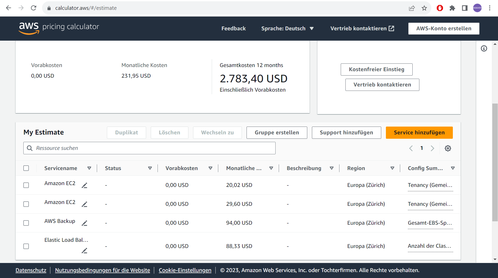
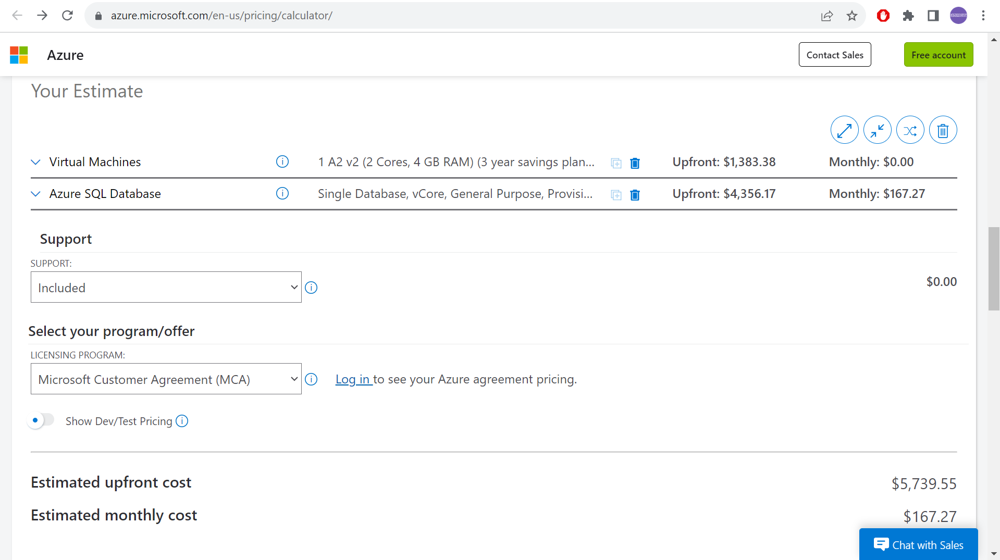
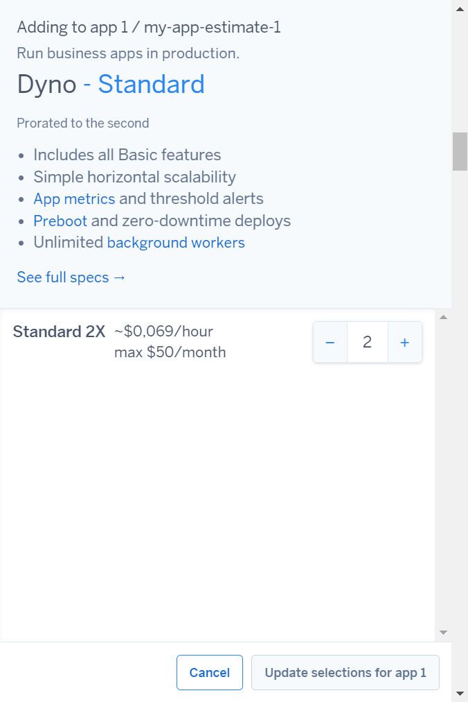
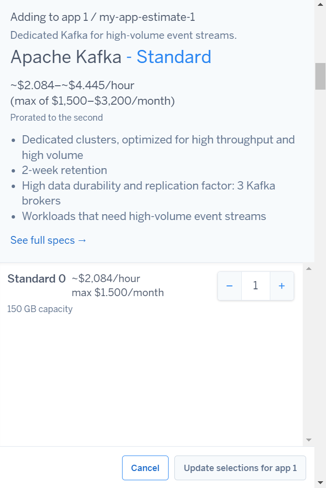
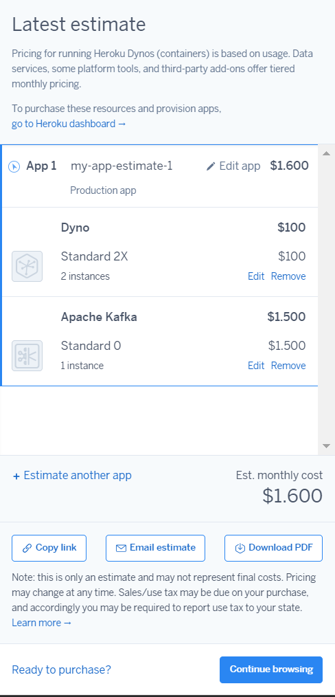
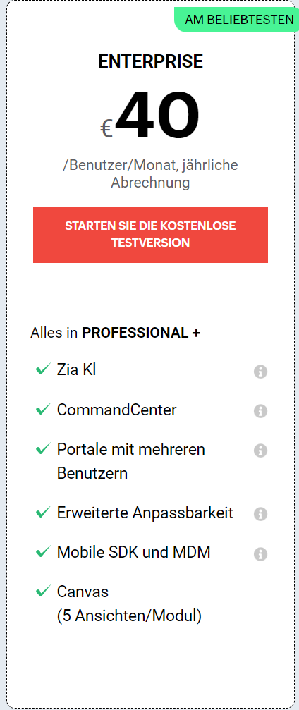
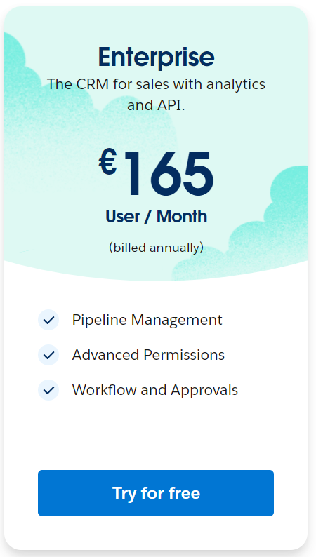

# Kostenberechnung

## Kostenrechnung erstellen

### Rehosting

[My-Estimate-AWS](My-Estimate-AWS.json)

[Pricing-Calculator-AZURE](Pricing-Calculator-AZURE.pdf)

Azure ist insgesamt die teurere der beiden Konfigurationen, dazu muss man beachten, dass dabei kein Load Balancing in die Rechnung miteinbezogen wurde, da es nicht zur Verfügung steht.
AWS macht den etwas professionelleren Eindruck, aufgrund der verschiedenen Möglichkeiten, so kann man auch das Load Balancing umsetzen. AWS bietet Standorte direkt in Zürich an, was die Sicherheit aufgrund der geografischen Nähe zusätzlich erweitern würde.

Aus meiner Sicht bietet AWS die bessere Lösung. Die Konfiguration, wie wir sie benötigen, ist komplett und auch direkt in Zürich gehostet. Der Preis, gegenüber Azure, gestaltet sich günstig und wird zusätzlich durch die genannten Vorteile rechtfertigt.

### Replatforming

Heroku bietet eine vorgefertigte Instanz für den Webserver an, welchen wir auch redundant installieren können. Ebenfalls können wir eine SQL-Datenbank installieren.
Weitere Möglichkeiten sind jedoch sehr eingeschränkt und schon integriert, wie zum Beispiel das Backup oder der Load Balancer.

### Repurchasing

Bei Zoho haben wir die Möglichkeit von Portalen mit mehreren Benutzer, was wir für unsere 16 Personen Firma benötigen. Deswegen auch die Enterprise Variante.
Von Salesforce benötigen wir die Enterprise Version, da es dort die Möglichkeit auf erweiterte Rechte gibt, was bei der Erstellung unserer App nötig ist.

Gegenüberstellung der ver. Lösungen:
Meiner Meinung nach eignet sich das IaaS System um unser Problem zu lösen. Dort würde ich auf den Anbieter AWS zurückgreifen, da man praktisch alle Möglichkeiten hat, um die CRM-Software zu realisieren. Alle anderen Lösungen ziehen Einschränkungen mit sich und werden daher auch immer Probleme mit sich bringen.

## Interpretation der Resultate

Die Angebote unterscheiden sich teilweise stark von einandern. So reden wir von einem Preisbereich zw. 40-6'000 USD.
Das billigste Angebot ist von Zoho CRM. Azure das teuerste Angebot.

Insgesamt müssen wir berücksichtigen, dass je nachdem verschiedene Optionen mit mehr oder weniger zusätzlichen Kosten auftreten können.
So müssen wir mit ungeplanten Aufwänden rechnen, zum Beispiel das Reshapen einer Software oder Ähnliches. Weiter können Skalierungen in der Zukunft teuerer werden.
Bei einigen Angeboten wissen wir auch nicht, ob wir sie alle Anforderungen erfüllen um unsere CRM-software tatsächlich umsetzen zu können.
Schlussendlich schätzen wir die Situation ab und müssen flexibel entscheiden. Es ist eine Abwägung zwischen Freiheiten und Pflichten, welche man mit gewissen Lösungen verliert, resp. dazugewinnt.